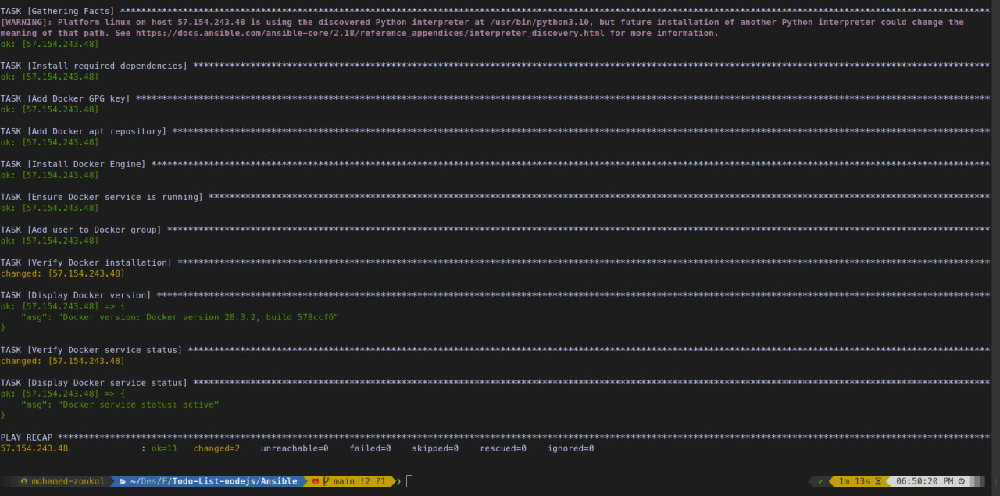

# 🚀 DevOps Internship Assessment

This repository contains the full solution to the DevOps Internship Assessment as outlined in the task brief.  
The work is divided into clearly structured parts, with each part addressing key DevOps concepts such as containerization, CI/CD, infrastructure provisioning, and automated deployment.

---

## 📦 Part 1: Dockerization & CI Pipeline

### ✅ Summary

- Cloned a Node.js Todo app from [this repo](https://github.com/Ankit6098/Todo-List-nodejs)
- Create a Mongo Cluster
- Configured the app to connect to a personal MongoDB Atlas instance via `.env` file
- Dockerized the application using a custom `Dockerfile`
- Create a private Docker Hub repository
- Set up GitHub Actions to:
  - Build the Docker image
  - Push it to a private Docker Hub repository on every `push` to `main`

### 🛠 Technologies Used

- Docker
- GitHub Actions
- MongoDB Atlas
- Docker Hub (private repo)

### 📁 Files and Directories

- `.env` → contains MongoDB credentials (**not committed**)
- `Dockerfile` → for building the app image
- `.dockerignore` → to reduce image size
- `.github/workflows/docker.yml` → CI pipeline config

### 📋 GitHub Secrets

| Secret Name       | Purpose                          |
| ----------------- | -------------------------------- |
| `DOCKER_USERNAME` | Docker Hub username              |
| `DOCKER_PASSWORD` | Docker Hub password or token     |
| `IMAGE_NAME`      | Name of the Docker image to push |

> ✅ **Status**: Completed and Verified

---

## ⚙️ Part 2: VM Provisioning with Ansible (30 points)

### 📝 Objective

- Provisioned an **Ubuntu 22.04 VM** on **Microsoft Azure**.
- Configured SSH access using a private key.
- Wrote an **Ansible Playbook** to:

  - Install required dependencies.
  - Add Docker’s official GPG key and repository.
  - Install Docker CE, CLI, and containerd.
  - Start the Docker service and enable it on boot.
  - Add the user to the `docker` group.
  - Verify Docker installation and service status.

  ### 📄 Playbook Highlights

- Used `apt_repository` for secure repo addition.
- Used `gpg --dearmor` to store keys under `/usr/share/keyrings/`
- Included verification tasks for:
  - Docker version
  - Docker service status

### 📋 Tasks

- ✅ Created an Azure VM (Ubuntu 22.04)
- ✅ Wrote Ansible inventory and playbook (`install_docker.yml`)
- ✅ Installed Docker, Docker CLI, and containerd
- ✅ Enabled and verified Docker service
- ✅ Added `ubuntu` user to the `docker` group

### 🖼️ Execution Output Screenshot

## 

## 🧱 Part 3: Docker Compose & Auto Update (40 points)

### 📝 Objective

- Deploy the application on the VM using Docker Compose
- Configure health checks
- Implement an auto-update mechanism to pull the latest image from Docker Hub when available

### 🔧 Tools Considered for Auto Update

- Watchtower
- Ouroboros
- Custom cron + pull script (fallback)

> 🛠 **Status**: Pending

---

## ☁️ Part 4 (Bonus): Kubernetes & ArgoCD (50 points)

### 📝 Objective

- Deploy the app using Kubernetes instead of Docker Compose
- Use ArgoCD for GitOps-style continuous deployment

### 📋 Tasks

- [ ] Install K3s or Minikube on the VM
- [ ] Write Kubernetes manifests (Deployment, Service, etc.)
- [ ] Install ArgoCD and connect to GitHub repo
- [ ] Configure auto-sync on image update

> 🛠 **Status**: Pending

---

## 🔐 Security Note

> 🔒 **No secrets, credentials, or sensitive environment variables are committed to this repository.**  
> All secret information is managed securely via `.env` and GitHub Secrets.

---

## 🧠 Assumptions

- MongoDB is cloud-hosted on MongoDB Atlas
- Docker Hub repository is private and pre-created
- Cloud VM or local VM uses Ubuntu 22.04+
- SSH access is secured with keys, not passwords

---

## 📅 Deadline

> **Thursday, July 31st at 4:00 PM**

---

## ✅ Progress Checklist

- [x] Part 1: Docker + CI
- [ ] Part 2: Ansible + VM
- [ ] Part 3: Compose + Auto Update
- [ ] Part 4: Kubernetes + ArgoCD

---

## 👤 Author

**Mohamed Zonkol**  
DevOps Enthusiast & Internship Candidate  
Email: `mo.zonkol@gmail.com`
