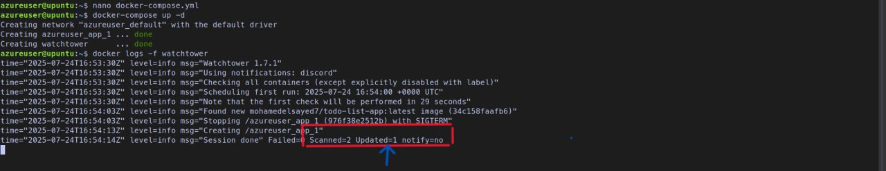
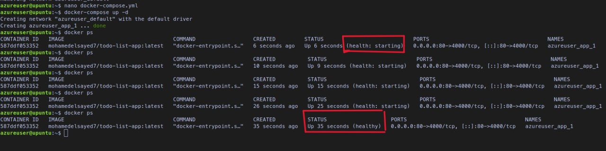
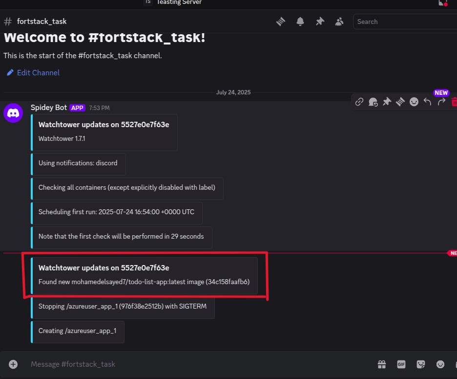
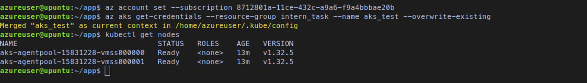
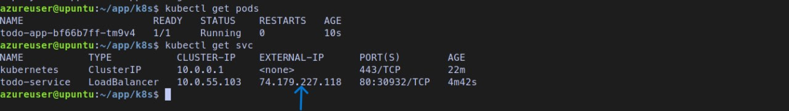
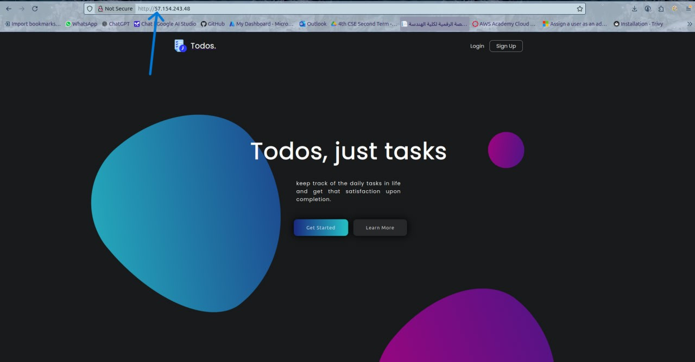

# 🚀 DevOps Internship Assessment

This repository contains the full solution to the DevOps Internship Assessment as outlined in the task brief.  
The work is divided into clearly structured parts, with each part addressing key DevOps concepts such as containerization, CI/CD, infrastructure provisioning, and automated deployment.

**Technologies Used:**  
Docker · GitHub Actions · Docker Compose · Watchtower · Ansible · Kubernetes (AKS) · ArgoCD · MongoDB Atlas · Discord Webhooks · Azure CLI · Ubuntu 22.04

---

## 📦 Part 1: Dockerization & CI Pipeline

### ✅ Summary

- Cloned a Node.js Todo app from [this repo](https://github.com/Ankit6098/Todo-List-nodejs)
- Create a Mongo Cluster
- Configured the app to connect to a personal MongoDB Atlas instance via `.env` file
- Dockerized the application using a custom `Dockerfile`
- Create a private Docker Hub repository
- Set up GitHub Actions to:
  - Build the Docker image
  - Push it to a private Docker Hub repository on every `push` to `main`

### 🛠 Technologies Used

- Docker
- GitHub Actions
- MongoDB Atlas
- Docker Hub (private repo)

### 📁 Files and Directories

- `.env` → contains MongoDB credentials (**not committed**)
- `Dockerfile` → for building the app image
- `.dockerignore` → to reduce image size
- `.github/workflows/docker.yml` → CI pipeline config

### 📋 GitHub Secrets

| Secret Name       | Purpose                          |
| ----------------- | -------------------------------- |
| `DOCKER_USERNAME` | Docker Hub username              |
| `DOCKER_PASSWORD` | Docker Hub password or token     |
| `IMAGE_NAME`      | Name of the Docker image to push |

> ✅ **Status**: Completed and Verified

---

## ⚙️ Part 2: VM Provisioning with Ansible

### 📝 Objective

- Provisioned an **Ubuntu 22.04 VM** on **Microsoft Azure**.
- Configured SSH access using a private key.
- Wrote an **Ansible Playbook** to:

  - Install required dependencies.
  - Add Docker’s official GPG key and repository.
  - Install Docker CE, CLI, and containerd.
  - Start the Docker service and enable it on boot.
  - Add the user to the `docker` group.
  - Verify Docker installation and service status.

  ### 📄 Playbook Highlights

- Used `apt_repository` for secure repo addition.
- Used `gpg --dearmor` to store keys under `/usr/share/keyrings/`
- Included verification tasks for:
  - Docker version
  - Docker service status

### 📋 Tasks

- ✅ Created an Azure VM (Ubuntu 22.04)
- ✅ Wrote Ansible inventory and playbook (`install_docker.yml`)
- ✅ Installed Docker, Docker CLI, and containerd
- ✅ Enabled and verified Docker service
- ✅ Added `ubuntu` user to the `docker` group

### 🖼️ Execution Output Screenshot

## 

## 🧱 Part 3: Docker Compose & Auto Update

### 📝 Objective

✅ Deploy the application on the VM using Docker Compose

✅ Configure proper health checks

✅ Implement an auto-update mechanism to pull the latest image from Docker Hub

✅ Send Discord notifications on updates

✅ Automate deployment using Ansible Playbook

🐳 Docker Compose Setup

The application is deployed via docker-compose with the following configuration:

    Exposes the application on port 80 (mapped internally to 4000)

    Connects to a MongoDB Atlas database using an environment variable

    Implements a health check using wget to confirm the app is reachable

    Ensures container restarts on failure

🔁 Auto Update with Watchtower

Tool Chosen: Watchtower

Why Watchtower?

    Lightweight and container-friendly

    Integrates with Docker Hub

    Supports private image registries with config.json

    Can send update notifications via Discord, Slack, etc.

📬 Discord Notification

    Watchtower successfully sends a notification to the designated Discord channel when an image update is detected and applied.

    Verified working with a test image push to Docker Hub.

🤖 Ansible Playbook for Docker Compose Deployment

We created an Ansible Playbook to automate the deployment of the app using Docker Compose on the Azure VM

🧪 Results

    ✅ App container updates automatically when a new image is pushed

## 

    ✅ Health checks confirm container is running before marking it healthy

## 

    ✅ Discord alerts are delivered upon update

## 

    ✅ System is now fully automated and monitored

---

## ☁️ Part 4 (Bonus): Kubernetes & ArgoCD

### 📝 Objective

- Deploy the app using Kubernetes instead of Docker Compose
- Use Azure Kubernetes Service (AKS) to host the application
- Set up ArgoCD for Continuous Delivery (CD)

☸️ Kubernetes Deployment on AKS

- Created a managed AKS cluster on Azure
- Installed `kubectl` on the VM and connected to the AKS cluster using `az aks get-credentials`
- Deployed the application with:

  - `deployment.yaml` (for the app container)
  - `service.yaml`

- Verified deployment:
  - Pod running successfully
  - App accessible externally using Azure Public IP

## 

## 

📦 ArgoCD Setup for GitOps CD

    Installed ArgoCD using kubectl apply -n argocd -f https://.../install.yaml

    Patched argocd-server to LoadBalancer for public dashboard access

    Logged into the ArgoCD web UI via:

        External IP: http://<ARGO_EXTERNAL_IP>

        Initial Password: extracted from the argocd-initial-admin-secret

    Created an application in ArgoCD pointing to the GitHub repo

    Enabled auto-sync from GitHub (private repo access via manual config)

## 

---

## My App

## 

## 🧠 Assumptions

- MongoDB is cloud-hosted on MongoDB Atlas
- Docker Hub repository is private and pre-created
- Cloud VM In Azure uses Ubuntu 22.04+
- SSH access is secured with keys, not passwords

---

## 👤 Author

**Mohamed Zonkol**  
Email: `mo.zonkol@gmail.com`
